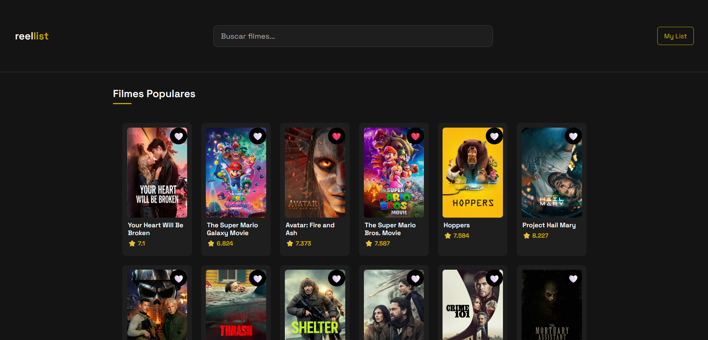
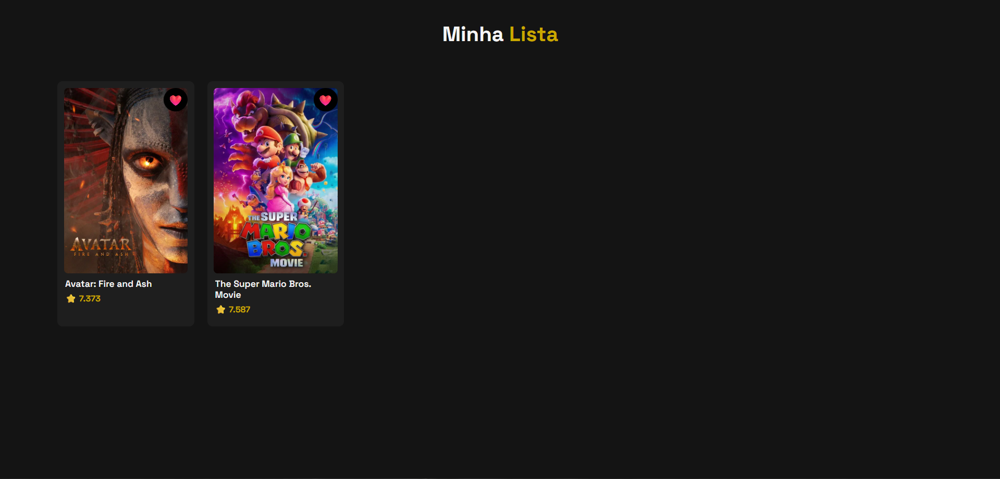

# ReellList


Aplicação web desenvolvida com React + Vite para explorar filmes usando a API do TMDB.

O projeto permite visualizar filmes populares, buscar títulos em tempo real e criar uma lista pessoal de favoritos com persistência local.

## Links

- Repositório: [github.com/marialuisasanches/reellist](https://github.com/marialuisasanches/reellist)
- Deploy:[https://reellist.vercel.app](https://reellist.vercel.app/)

## Imagens

### Home



### Minha Lista




## Visão Geral

O ReelList foi criado com foco em uma experiência simples, rápida e agradável para navegação de filmes.

Principais objetivos do projeto:

- Exibir filmes populares na página inicial
- Permitir busca com resposta fluida via debounce
- Gerenciar favoritos com atualização imediata na interface
- Manter a lista de favoritos salva no navegador

## Funcionalidades

- Exibição de filmes populares na Home
- Barra de busca com debounce para pesquisa de filmes
- Botão de favorito no MovieCard
- Adicionar e remover filmes da lista usando localStorage
- Página My List com filmes favoritados
- Navegação entre páginas com React Router

## Tecnologias Utilizadas

- React
- Vite
- React Router
- CSS Modules
- JavaScript (ESModules)
- API do TMDB

## Como Executar o Projeto

### 1) Instalar dependências

```bash
npm install
```

### 2) Configurar variável de ambiente

Crie um arquivo `.env` na raiz do projeto e adicione sua chave da API do TMDB:

```env
VITE_API_KEY=sua_chave_aqui
```

Como obter a chave:

1. Crie sua conta em https://www.themoviedb.org/
2. Acesse as configurações de API da conta
3. Gere sua API Key e use no `.env`

### 3) Rodar em desenvolvimento

```bash
npm run dev
```

Depois, abra a URL exibida no terminal (geralmente http://localhost:5173).

## Scripts Disponíveis

- `npm run dev`: inicia o servidor de desenvolvimento
- `npm run build`: gera build de produção
- `npm run preview`: visualiza a build localmente
- `npm run lint`: executa validação com ESLint

## Estrutura de Pastas

```text
.
|- .env
|- index.html
|- package.json
|- vite.config.js
|- src
|  |- main.jsx
|  |- App.jsx
|  |- index.css
|  |- App.css
|  |- components
|  |  |- SearchBar.jsx
|  |  |- SearchBar.module.css
|  |  |- MovieList.jsx
|  |  |- MovieList.module.css
|  |  |- MovieCard.jsx
|  |  |- MovieCard.module.css
|  |- pages
|  |  |- Home.jsx
|  |  |- Home.module.css
|  |  |- MyLists.jsx
|  |  |- MyLists.module.css
|  |- services
|  |  |- api.js
|  |- hooks
|     |- useLocalStorage.js
```

## Melhorias Futuras

- Implementar paginação/infinite scroll na listagem de filmes
- Adicionar detalhes completos do filme em uma página dedicada
- Criar feedback visual para estados de carregamento e erro
- Implementar testes de componentes e fluxos principais
- Evoluir persistência para backend/autenticação de usuário

## Autor

Desenvolvido por Maria Luisa Sanches.

Conecte-se comigo:

- LinkedIn: [linkedin.com/in/maria-luisa-sanches](https://www.linkedin.com/in/maria-luisa-sanches)
- E-mail: [marialuisasanches.dev@gmail.com](mailto:marialuisasanches.dev@gmail.com)
